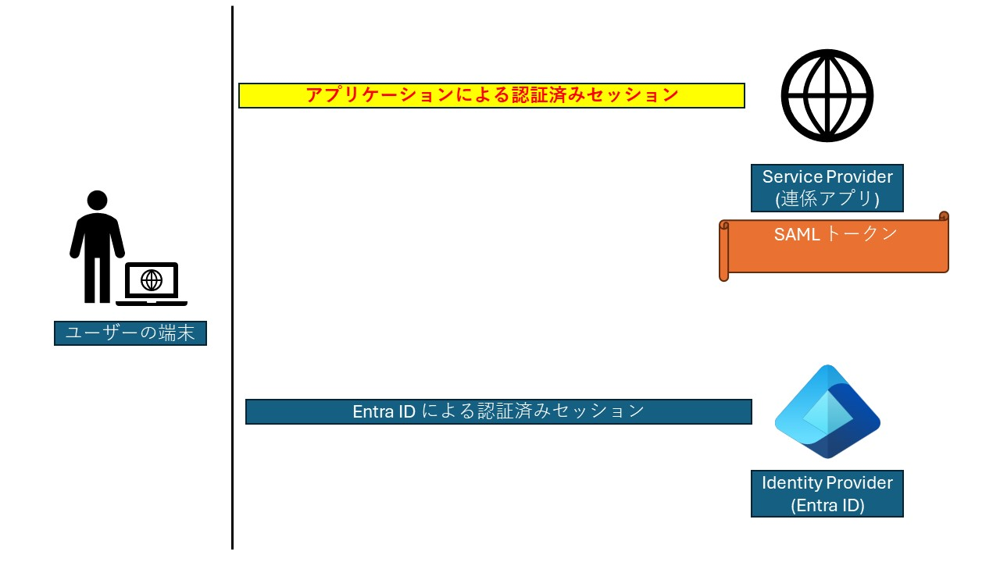

# SAML シングル サインオンを構成しているアプリケーションで発生する認証時刻のギャップによるエラーについて

こんにちは！ Azure & Identity サポート チーム成田 将平です。  
今回は Entra ID と SAML シングル サインオン連係しているアプリケーションにおいて「認証時刻」のギャップによって発生する問題について解説します。  

先に結論からお伝えするとアプリケーション側の設定変更もしくは実装の変更が可能であれば、その方法で回避いただくのが最も適切です。  
ただし、それが可能ではない場合もあるかと存じますので、最後には Entra ID の条件付きアクセス ポリシーを利用した問題の回避方法をご紹介します。

## SAML シングル サインオンの目的と仕組み

本題に入る前に、簡単に SAML シングル サインオンの目的と流れを振り返りましょう。  

シングル サインオンの目的は、Entra ID で認証した結果を信頼し、Service Provider (連係アプリ、Box や AWS など...) にサインインすることです。  
これは言い換えると、Entra ID と ユーザーの端末 (ブラウザ) 間のセッションを信頼して、Service Provider とユーザーの端末 (ブラウザ) 間のセッションを発行することと言えます。  

詳しくは以下の公開情報のシーケンス図を参考にいただきたいのですが、ここではもう少し視覚的に流れを解説します。  

[シングル サインオンの SAML プロトコル | Microsoft Learn](https://learn.microsoft.com/ja-jp/entra/identity-platform/single-sign-on-saml-protocol)

### 1. ユーザーは Entra ID にサインインする

どんな認証方法でも構いません。  
SAML SSO 連係済みのアプリケーションにサインインするブラウザで Entra ID にサインインします。  
デバイスを登録して PRT でサインインしても構いませんし、ID とパスワードを入力しても、AD FS で証明書認証を実施しても同じように Entra ID とユーザーのブラウザ間にはセッションが作成されます。

### 2. アプリケーションからの要求を受けて Entra ID は SAML トークンで応答する

たとえば、ユーザーがアプリケーションで「Entra ID でサインイン」ボタンをクリックすると、アプリケーションは Entra ID に対して SAML リクエストを送信します。
Entra ID は、ユーザーが Entra ID にサインインしていれば即座に SAML トークン (SAML レスポンス) を発行します。

### 3. アプリケーションは受け取った SAML トークンを検証する

アプリケーションは、事前に SAML シングルサインオン設定で連携し SAML トークン署名証明書 (公開鍵) を利用して、受け取った SAML トークンを検証します。  
この検証により  
**今アプリケーションにアクセスしようとしているユーザーが連係している IdP (Entra ID テナント) で認証が完了している**  
という事実を信頼することができます。

### 4. アプリケーションはユーザーをサインインさせる

3 でこのユーザーが Entra ID で正しく認証されたユーザーであることが確認できたので、当初の目的であった「Entra ID と ユーザーの端末 (ブラウザ) 間のセッションを信頼して、Service Provider とユーザーの端末 (ブラウザ) 間のセッションを発行すること」が完了します。  

これが、全てが平和に終わったパターンの SAML によるシングル サインオンの簡単な流れです。

## 認証時刻のギャップによって問題が発生するパターン

本題に入ります。  
実は SAML トークンにはサインイン ユーザーのアカウント情報だけではなく、サインイン時の様々な情報が含まれています。  
今回、問題の原因になるのが AuthnStatement の AuthnInstant 属性です。

[シングル サインオンの SAML プロトコル | Microsoft Learn](https://learn.microsoft.com/ja-jp/entra/identity-platform/single-sign-on-saml-protocol)
> AuthnStatement  
> この要素は、アサーション サブジェクトが特定の時刻に特定の手段によって認証されたことをアサートします。
> 
> ・AuthnInstant 属性は、Microsoft Entra ID でユーザーが認証された時刻を指定します。  
> ・AuthnContext 要素は、ユーザーの認証に使用された認証コンテキストを指定します。
```xml
<AuthnStatement AuthnInstant="2013-03-18T07:33:56.000Z" SessionIndex="_bf9c623d-cc20-407a-9a59-c2d0aee84d12">
  <AuthnContext>
    <AuthnContextClassRef> urn:oasis:names:tc:SAML:2.0:ac:classes:Password</AuthnContextClassRef>
  </AuthnContext>
</AuthnStatement>
```

実は、この AuthnInstant 属性は、**SAML トークンが発行された時刻ではありません。**  
AuthnInstant 属性は、**ユーザーの端末と Entra ID のセッションが作成されたときにユーザーが明示的な認証を完了した時刻を示します。**

Entra ID のセッション トークンは既定で 90 日間のローリング ウィンドウです。  
つまり、一度発行されたセッションは、ユーザーが Entra ID の利用を継続している限り、無限に延長されていきます。  
この動作によって SAML トークンに含まれる AuthnInstant 属性はどんどん古くなっていきます。  
もちろん、時刻が古くなったといってもセッションを利用するたびに Entra ID で検証されていますので、それが脆弱になっているということでは全くありません。  
過去にお問い合わせいただいた事例では、1 年以上も古い日時が AuthnInstant 属性入っているものもございましたが、Entra ID としては想定された動作です。

ただし、事実として SAML トークンが発行された時刻と、SAML トークンに含まれる AuthnInstant 属性にはギャップが発生することになります。  
古くなった AuthnInstant 属性に注目して、前述の「SAML シングル サインオンの目的と仕組み」項と同じように流れを追っていきます。

### 2A. アプリケーションからの要求を受けて Entra ID は結構古い AuthnInstant 属性を含む SAML トークンで応答する

前述の理由で、Entra ID が発行する SAML トークンの AuthnInstant 属性は結構古くなることがあります。  

### 3A. アプリケーションは受け取った SAML トークンを検証するけど嫌な気持ちになる

SAML トークンの発行日時は別の属性で検証が可能 (※) ですので本来は問題がありません。  
ただし、アプリケーションの仕様によっては古すぎる AuthnInstant 属性が含まれた SAML トークンを信頼できない場合があります。

### 4A. アプリケーションはユーザーをサインインさせない

SAML トークンが信頼できなかったのでアプリケーションはユーザーのサインインを拒否します。  
このとき、アプリケーションがユーザーにどのように表示するかはアプリケーションの仕様次第です。  
たとえば、  

- アプリケーションの管理者にお問い合わせください。  
- SAML トークンの検証に失敗しました。  
- Entra ID での認証時刻が古すぎるためサインインが失敗しました。  

といったメッセージで知らされ、実際にはアプリケーション側のサインイン ログなどを確認することになります。  

